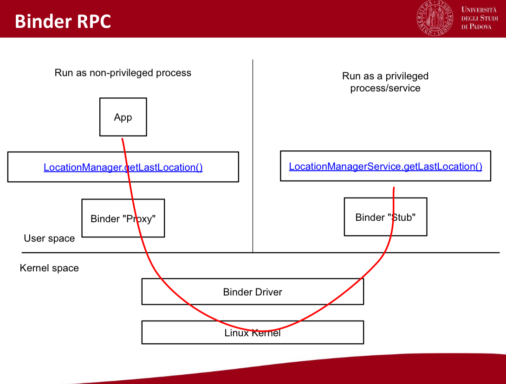

# Mobile Security
by Alberto Morini

### Android Architecture

1) System apps: email, calendar, camera
2) Java API framework: content provider, view system, notification, activity
3) Native C++ libraries / Android Runtime
4) Hardware Abstraction Layer (HAL): Audio, Bluetooh, camera, sensor
5) Linux kernel: audio, keypad, USB, WIFI

### AndroidManifest file

- Components, permission and other metadata are specified there
- Package name is app unique identifier (eg. com.signal.app)
- Package name constraints on android device and on the PlayStore

### Basic
- no "main", user interacts via graphical UI (widgets)
- Many APIs are "event-driven"
	1) You register a "listener" X
	2) X's callback is invoked later on


## Chap 2

### Activity

**Android Activity**: is a single, focused thing that user can do.
	- almost all interact with the user
	- you can place your UI with `setContentView(View)`
	- other stuff
		- Floating window
		- Multi-window mode

##### MAIN
- You can define which one is the "main" one, this is the chose one when you start your app
- if the app allows it, an external app can start these activities at will (eg. telegram open contact page when scanned QR code)

Activity will implement:
1) `onCreate(Bundle)` = where you initialize the activity, most importantly here we call setContentView(int) with layout resource
2) `onPause()` = is where you deal with the user pausing active interaction with the activity
	- any changes made by the user should at this point be committed (usually to the ContentProvider)


**Fragments**: subclass of this one, can provide better modulation to the code, ubild more sophisticated user interface

**Lifecycle**: 


### Permission

> the ability to start a particular Activity can be enforced when declared in the manifest `<activity>`

By doing so, other apps will need to declare a corrisponing `<user-permission>` element in their own manifest to be able to start that activity

##### Intent
> `Intent.FLAG_GRANT_READ_URI_PERMISSION  || Intent.FLAT_GRANT_WRITE_URI_PERMISSION

This will grant the Activity access to specific URIs in the INTENT.
Access will remain until the activity has finished.


### Process lifecycle

1) **foreground activity**: activity at the top of the screen that user is currently interacting with, is considered the most important.
   It process will only be killed as last resort -> if it uses more memory than is available on the device
2) **visibile activity**: activity such as one sitting behind a foreground dialog or next to other activities (in multi-windows), is considered extremely important and will not be killed unless that is required to keep the foreground activity running
3) **background activity**: is no longer critical, os the system may safely kill it, to reclaim memory for other foregorund/visible process.
	   If back to the screen will be recalled `onCreate(Bundle)` method, with the savedInstanceState it had previously supplied in `onSaveInstanceState(Bundle)` so it can restart itself in the same state as user last left it
4) **Empty process**: is one hosting no activities or other application components (such as Service or BroadcastReceiver classes). So, any process outside an activity, needs to be executed in the context of activity BroadCastReceiver or Service, to ensure that the system knows it needs to keep your process around.
#### Service
- performs an action in the background for some period of time, regardless of that user is doing in foreground (eg. music player service)
- they don't provide user interface
#### Broadcast receiver
- they are meant to respond to system-wide events
- they have well-defined entry point
- the system can deliver these events event to app that are not running (eg.  push notification, battery charging)


### Content provider

- they manage a shared set of app data
- high-level API to access data, so other apps and service can query/interact with it
- they abstract away the storing mechanism
- most often based on SQLite database (file-based)

### IPC
built on top of the Binder components
	- intents --> commands and data delivered to components
	- messengers -> object supporting message-based communication
	- content providevs -> components exposing cross-process data management
	- AIDL -> enables a client to call a remote object as it was local one

##### Communication use case
> A.X (A's component X)

- A.X wants to start A.Y (eg. go next activity)
- A.X wants to send data to B.Z
NB: each component has its life cycle, A.Y could be already "started"

### Intent

check permission [Intent](####Intent)

> Is messaging object you can use to request an action from another app component

**Explicit**: the intent specifies which component it wants to talk to, it specifies the target's full package/component
-  more secure
```
Intent i = new Intent(this, SecondActivity.class);
i.setData("Here is some data for act2");
i.putExtra("arg1","and here some moreee");
startActivity(i);
```


**Implicit**: the intent just describe the type of action to perform (optionally, some data)
```
String url = "http://www.duckduckgo.it";
Intent i = new Intent(Intent.ACTION_VIEW); //ACTION
i.setData(Uri.parse(url));
startActivity(i);
```

Intent is sent around the system with the hope that some other apps will do something about it.


#### Intent filters
- mechanism for apps to declare something like: "My component X can handle intents of `<TYPE>`"
- When an app send an implicit intent, the system knows that it can count on X


###  Android Security Model

1) **Sanbox model**: 
	   - each app has its UID and dedicated data directory
	   - isolated at the process level and at file system leve
	   - "/data/system/package.list" -> contains all the information
2) **Android permission model:**
	- Due to the sandbox model, Android apps can access only to their own files
	- permission are fine-grained access rights
	- defined in the AndroidManifest file
	- Granted in different moments according to their severity level
	- relate permission are mapped into the same GID
3) **App signature**
	- Apps are signed by the dev
	- there's no Certification Authority in Android
	- Signatures are used for updating apps
	- system apps are signed by a number of platform keys-> are generated by the entity responsible for the Android image runing
4) SELinux
	- Security enhanced linux, is a MAC implementation for Linux Kernel
	- isolated system daemons and apps in different security domains, it defines access policies for each domain
	- *enforcing mode is applied to system dameons*
	- permissive mode is applied to apps
5) Verified Boot
	- The verification is performed by the kernel through an RSA public key saved into the boot partition
	- device blocks are checked at runtime
	- device blocks are checked at runtime
	- each device block is hashed ant the hash value is compared to the one of the original block
	- the kernel itself is verified through a key that is burned into the device


## Chap 3 - OS integration

Each app has it owns Linux user **ID**, and lives in it's own security sandbox
- standard Linux process isolation
- restricted file system permission

### Storage

For each app is given a private data directory.
- called “internal storage”
- No other app can access it

Apps run in separate process (sandbox):
- they can’t talk to each other
- they can’t do anything security-sensitive

#### Syscalls

- **User-space**: they can’t do much by themselves
	- Android Frameowk (content provider, location, notification)
	- Native libraries (audio manager, SQLite, webkit) + Android runtime (core libraries)
	- HAL (audio, bluetooth, camera)
- **Kernel-space**: the os is the God on your machine and information
	- Linux kernel: drivers (bluetooth, camera), power management

**Saving file** -> the process/app can’t access to the physical HDD, so, asks the OS to save file “X” with the content “ABC”.

*In code:*
```java
OutputStreamWriter writer = new OutputStreamWriter(…)
writer.write(data); 
writer.close();
````

*In flow*: Java -> libc -> syscalls

##### Invoke a syscall
Each architecture has it own convention
- x86 -> number in “eax”
- X86-64 -> number in “rax”
- ARM -> number in “r7” && execution instruction “swi”/“svc”

#### Other sys requests
- app invoked Android API 
	- Location manager.getLastLocation();
	- We’re in a “privileged” service
##### Binder
Allows for: RPC (Remote Procedure Call) && Internal-process communication (IPC)




- Proxy (”provider”) and stub (”receiver”) are automatically generated starting from AIDL.
- Binder internals
	- Multi-purpose syscalls, to talk to drivers
	- Binder kernel driver takes care of it, dispatches messages and returns replies
- Many managers: package, activity, notification, location…

##### IPC mechanism
1. App A (non privileged process) -> Binder driver 
2. Binder driver -> Ask ActivityManager (privileged process)
	1. ActivityManger replay
3. Activity B.x onCreate (non privileged process)

### Permissions
- normal
- Dangerous
	- If API>22 and app’s target > 22 (ANDROID 6- api23)
		- The user is not notified at install time
		- The app initially doesn’t have that permission, but it can be asked on runtime
		- Users can disable them
	- If API<23 or target <23
		- The user is asked about all permission at installation time
		- If doesn’t accept: app installation is aborted
		- Uses cannot disable them
- Signature
- SignatureOrSystem

### Runtime/Install prompts

**Runtime**
- pros: users can install apps without giving all permissions
- pros: users have contextual information to decide accept/reject
- pros: permission can be selectively enabled/disabled
- cons: multiple prompts can be annoying
**Install**
- pros: no annoying prompts after installation
- Cons: “all or nothing”
- No contextual info to take informed decision

### groups

Permission are organized in groups, requests are handled at group level
> user grants X -> all permission in X’s group are automatically granted if an app’s update ask for them

*Example*
- sms permission group `(RECEIVE_SMS, READ_SMS, SEND_SMS)`
- Phone permission group `(READ_PHONE_STATE, READ_PHONE_NUMBERS, CALL_PHONE, ANSWER_PHONE_CALLS)`

### From app
`<users-permission android:name=“android.permission.SEND_SMS”/>`
<br/>Linux groups: ”inet” (internet), “bt_net” (bluetooth

##### custom permissions
- apps can define “custom” permission
- The system permission are defined in the same way
- By default, android:exported is false
	- **But** **if the component defines an “intent filter” then, the default value  is true**

App’s component can specify which permissions are required to use them:
```xml    
<receiver
	android:name="com.example.myapp.DeadlyReceiver" 
	android:permission="com.example.myapp.permission.DEADLY_STUFF">
	<intent-filter>
		<action android:name="com.example.myapp.action.SHOOT"/>
	</intent-filter>
</receiver>
```

***use case***

- protectionLevel = ”signature”
	- Only apps signed by the same dev/company can get it
	- *ex: facebook wants all its apps to have access to users’s post*
	- *facebook doesn’t want any other app to have access to information*
- protectionLevel =“dangerous”
	- App controls security-related things / information 
	- app wants to provide this capability to other apps, but it wants to warn the user first


## Chap 4

### App signing
Each app is signed with a certificate (public key + other metadata identifying the owner of the key)

> a certificate is an electronic document that is used to identify an individual.
> With a limited validity, Certificate Authorities (CAs) are entities that validate and issue certificates 

X509 standard is the most used.
- CA digital signature allows users to know and trust the CA, but don’t the entity that is identified by the certificate

#### certification authority
- ca signature guarantees the device key bond
- List of valid and expired certificates is public
- **Two kind of CA**: Public (trusted) and private (untrusted)

### Android app certificate
- can be self signed (not trusted by default)
- App author **NOT IDENTIFY** them

- System apps > signed via system certificate
	- System deals with “signature” permission 

**Chain of trust:** we trust the certificates which are trusted by at least one certificate we trust 


## Chap 5
